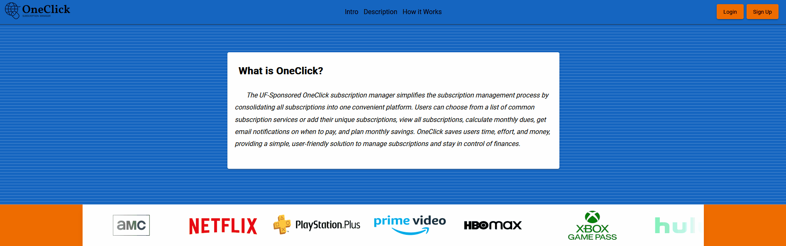

# UF-OneClick


## Project Description

<br>The UF-Sponsored OneClick subscription manager simplifies the subscription management process by consolidating all subscriptions into one convenient platform. Users can choose from a list of common subscription services or add their unique subscriptions, view all subscriptions, calculate monthly dues, get email notifications on when to pay, and plan monthly savings. OneClick saves users time, effort, and money, providing a simple, user-friendly solution to manage subscriptions and stay in control of finances. <br>

## Project Features

### Subscription List

<br>
### Subscription Report

<br>
### Subscription Graph

<br>

## Project Members
### Front-End
Gabriel Castejon (gabo0802) <br>
Matthew Denslinger (mslinger) <br>

### Back-End
Vladimir Alekseev (valekseev03) <br>
Mason Enojo (enojom) <br>

## Project Setup
1. Install the go programming language https://go.dev/dl/
2. Install Node.js https://nodejs.org/
3. Install Angular via the command line <code>npm install -g @angular/cli</code>
4. Install MySQL (might be optional, see <i> How to Install MySQL </i> for more info) <br>
5. Clone respository <code>git clone https\://github.com/gabo0802/UF-OneClick.git</code> or via SSH
6. Run <code> go get github.com/gin-gonic/gin </code>
7. Navigate to the client folder <code>cd Client</code> and run the command <code>npm install ng2-charts</code> and <code>npm install cypress</code>

## How to Run Project (Using Visual Studio)
1. Have the MySQLPassword.txt and EmailCode.txt files in same folder as makefile
2. Terminal -> New Terminal
3. Terminal -> Split Terminal
4. Run <code> make first </code> in first terminal
5. Run <code> make second </code> in second terminal
6. Go to: http://localhost:4200/ <br> (should open automatically)

## How to Install MySQL
### How to get MySQLStuff.go to work with Go and Visual Studios (Windows 10):
1. Install Go: https://go.dev/dl/
2. Install MySQL: https://dev.mysql.com/downloads/installer/ 
3. Run command in Command Prompt terminal:  <code> go env -w GO111MODULE="off" </code>
4. Run command in Visual Studio Code terminal: <code> go get github.com/go-sql-driver/mysql </code> <br>

### Access MySQL Database:
* (For Windows): <code> mysql.exe -h oneclickserver.mysql.database.azure.com -u adminUser -p </code>
* (For Mac): <code> /usr/local/mysql/bin/mysql -h oneclickserver.mysql.database.azure.com -u adminUser -p </code>
* Hostname: oneclickserver.mysql.database.azure.com
* Username: adminUser
* Password: <b>Found in MySQLPassword.txt</b>

```diff
- DISCLAIMER: Our subscription to the remote database service was cancelled so it can no longer be accessed
- To utilize the app's full features, a personal mySQL server and database must be utilized.
```
* Setting up a different branch that allows for this is in the works
